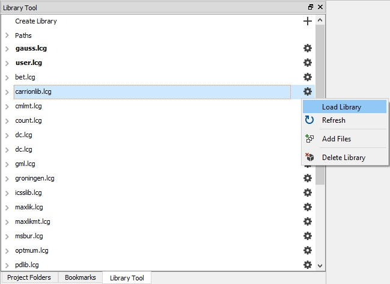

# gauss-qardl-library
 This repository houses the materials to install and use the [GAUSS quantile cointegration code by Jin Seo Cho](https://web.yonsei.ac.kr/jinseocho/qardl.htm).

## What is GAUSS?
 [**GAUSS**](www.aptech.com) is an easy-to-use data analysis, mathematical and statistical environment based on the powerful, fast and efficient **GAUSS Matrix Programming Language**. [**GAUSS**](www.aptech.com) is a complete analysis environment with the built-in tools you need for estimation, forecasting, simulation, visualization and more.

 ## What is the GAUSS QARDL library?
 The [**GAUSS**](www.aptech.com) **QARDL** library is a collection of [**GAUSS**](www.aptech.com) codes developed by [Jin Seo Cho](https://web.yonsei.ac.kr/jinseocho/qardl.htm). The [raw codes](https://web.yonsei.ac.kr/jinseocho/qardl.htm) provided by Jin Seo Jo have been modified to:
1. Make use of [**GAUSS**](www.aptech.com) structures.
2. Use the internal [quantileFit](https://docs.aptech.com/gauss/CR-quantilefit.html) procedure.
3. Include new comments and explanations in the example files.
4. Use up-to-date graphing tools in the example.

>Note: The **QARDL** library no longer requires the QREG library. It uses the internal [quantileFit](https://docs.aptech.com/gauss/CR-quantilefit.html) procedure instead.

 ## Getting Started
 ### Installing
 **GAUSS 20+**
 The GAUSS Time Series and Panel data tests library can be installed and updated directly in GAUSS using the [GAUSS package manager](https://www.aptech.com/blog/gauss-package-manager-basics/).

 **GAUSS 18+**
 The GAUSS Time Series and Panel data tests can be easily installed using the [**GAUSS Application Installer**](https://www.aptech.com/support/installation/using-the-applications-installer-wizard/), as shown below:

 1. Download the zipped folder `qardl_1.0.0.zip` from the [QARDL Library Release page](https://github.com/aptech/gauss-qardl/releases/tag/v0.1.0).
 2. Select **Tools > Install Application** from the main **GAUSS** menu.  
   

 3. Follow the installer prompts, making sure to navigate to the downloaded `qardl_1.0.0.zip`.
 4. Before using the functions created by `qardl` you will need to load the newly created `qardl` library. This can be done in a number of ways:
   *   Navigate to the **Library Tool Window** and click the small wrench located next to the `qardl` library. Select `Load Library`.  
   
   *  Enter `library qardl` in the **Program Input/output Window**.
   *  Put the line `library qardl;` at the beginning of your program files.

 >Note: I have provided the individual files found in `qardl_1.0.0.zip` for examination and review. However, installation should always be done using the [`qardl_1.0.0.zip` from the release page](https://github.com/aptech/gauss-carrion-library/releases) and the [**GAUSS Application Installer**](https://www.aptech.com/support/installation/using-the-applications-installer-wizard/).

## The qardl Procedure Returns
### Estimated P and Q Orders
These are the obtained QARDL orders obtained by the information criterion.

* The `demo.e` progam estimate a p order of 2 and a q order of 1.

~~~
Estimated p order
=========================================================
       2.0000000
=========================================================
Estimated q order
=========================================================
       1.0000000
~~~

### Long-run parameter estimate (&beta;)
*  These are the long-run parameters given from the lowest percentile. In the `demo.e` program there are two explanatory variables and three quantiles: 0.25, 0.50 and 0.75. The following results are printed for $\Beta$.

*  These are stored in the `qardlOut` structure in the `qardlOut.bigBt` element.

~~~
=========================================================
Long-run parameter estimate (Beta)
=========================================================

       6.6645846
       6.6668972
       6.6659552
       6.6666716
       6.6652370
       6.6663398
~~~

*  The first two values, 6.6645846 and 6.6668972, are the long-run parameters of the first and second parameters, respectively, at the 0.25 percentile.
*  The next two estimates, 6.6659552 and 6.6666716, are the long-run parameters of the first and second parameters, respectively, at the 0.50 percentile.
*  The final two estimates, 6.6652370 and 6.6663398, are the long-run parameters of the first and second parameters, respectively, at the 0.75 percentile.

### Covariance matrix estimate of long-run parameter (&beta;):
*  This is the estimated covariance of the long-run parameters.
*  These are stored in the `qardlOut` structure in the `qardlOut.bigbt_cov` element.

The `demo.e` program prints the following 6x6 covariance matrix:
~~~
=========================================================
Covariance matrix estimate of long-run parameter (Beta)
=========================================================

   107.147    -17.451     58.427     -9.516     39.498     -6.433
   -17.451     15.212     -9.516      8.295     -6.433      5.608
    58.427     -9.516     95.579    -15.567     64.614    -10.524
    -9.516      8.295    -15.567     13.570    -10.524      9.174
    39.498     -6.433     64.614    -10.524    101.923    -16.601
    -6.433      5.608    -10.524      9.174    -16.601     14.471
~~~

### Short-run parameter estimate (&Phi;)
* These are the short-run parameters given from the lowest percentile first.
* These are stored in the `qardlOut` structure in the `qardlOut.phi` element.

*  The `demo.e` program estimates an autoregressive order (p) of 2 and has three percentiles (0.25, 0.50, and 0.75). This results in 6 short-run parameter estimates. It prints the following results:
~~~
=========================================================
Short-run parameter estimate (Phi)
=========================================================

      0.25537159
   -0.0043015969
      0.26163588
   -0.0069863046
      0.26073101
   -0.0063757138
~~~

* The first two values (0.25537159 and -0.0043015969) are the
short-run parameters of the first and second lagged dependent variables, respectively at the percentile of 0.25.
* The next two estimates (0.26163588 and -0.0069863046) are the short-run parameters of the first and second lagged dependent variables, respectively at the percentile of 0.50.
*  The final two estimates (0.26073101 and -0.0063757138) are the short-run parameters of the first and second lagged dependent variables, respectively at the percentile of 0.75.

### Covariance matrix estimate of short-run parameter (&Phi;)
*  This is the estimated covariance of the short-run parameters.
* These are stored in the `qardlOut` structure in the `qardlOut.phi_cov` element.

*  The `demo.e` program estimates the following covariance for &Phi; :
~~~
=========================================================
Covariance matrix estimate of short-run parameter (Phi)
=========================================================

     0.238     -0.130      0.129     -0.070      0.087     -0.047
    -0.130      0.083     -0.070      0.045     -0.047      0.030
     0.129     -0.070      0.211     -0.115      0.142     -0.077
    -0.070      0.045     -0.115      0.074     -0.077      0.050
     0.087     -0.047      0.142     -0.077      0.225     -0.122
    -0.047      0.030     -0.077      0.050     -0.122      0.079
~~~

### Short-run parameter estimate (&gamma;)
*  These are the short-run parameters given from the lowest percentile.
*  These are stored in the `qardlOut` structure in the `qardlOut.gamma` element.

*  The `demo.e` program has 2 variables and three percentiles (0.25, 0.50, and 0.75). This results in 6 short-run parameter estimates. It prints the following results:

~~~
=========================================================
Short-run parameter estimate (Gamma)
=========================================================

     4.991
     4.993
     4.968
     4.969
     4.972
     4.973
~~~

*  The first two values (4.9913074 and 4.9930394) are the short-run parameters of the first and second variables, respectively at the percentile of 0.25.
*  The next two estimates (4.9684725 and 4.9690065) are the short-run parameters of the first and second explanatory variables, respectively at the percentile of 0.50.
*  The final two estimates (4.9698987 and 4.9707210) are the short-run parameters of the first and second explanatory variables, respectively at the percentile of 0.75.

### Covariance matrix estimate of short-run parameter (&gamma;)
* This is the estimated covariance of the short-run &gamma; estimates.
* This is stored in the `qardlOut` structure in the `qardlOut.gamma_cov` element.

*  The `demo.e` program estimates the following covariance for &gamma;:
~~~
=========================================================
Covariance matrix estimate of short-run parameter (Gamma)
=========================================================

     2.774      2.775      1.506      1.506      1.017      1.017
     2.775      2.776      1.506      1.506      1.017      1.017
     1.506      1.506      2.454      2.454      1.659      1.659
     1.506      1.506      2.454      2.455      1.659      1.659
     1.017      1.017      1.659      1.659      2.618      2.619
     1.017      1.017      1.659      1.659      2.619      2.619
~~~

## Wald Testing
The QARDl library provides the functions for performing Wald tests. The `wtestlrb`, `wtestlrp`, and `wtestlrg` procedures. The procedures perform Wald tests for &beta;, &phi;, and &gamma;, respectively. Each test returns the test statistic and it's corresponding p-value.

### Setting up the hypothesis tests
Each Wald test procedure requires 5 inputs to summarize the estimated parameters, the desired tests, and the data.

|Input|Description|
|:----|:----------|
|coeff|The &beta;, &phi; or &gamma; parameter estimates stored in `qardlOut.beta`, `qardlOut.phi`, or `qardlOut.gamma` elements, respectively.|
|cov|The estimated parameter covariance, stored in `qardlOut.beta_cov`, `qardlOut.phi_cov`, or `qardlOut.gamma_cov`, respectively.|
|bigR| The R restriction matrix in the null hypothesis.|
|smlr| The r restriction matrix in the null hypthesis.|
|data| The dataset used to estimate the coefficients.|

### Constructing the restriction matrices
The Wald tests in the QARDL library test the null hypothesis:


against the alternative  

   

### Example
As an example, consider the Wald test of &beta; that is performed in the `demo.e` program. This test looks at the null hypothesis:

    

To do this we set :

```
bigR = { 1 0 -1 0 0 0, 0 0 1 0 -1 0};
smlr = {0, 0};
```

### Wald test results
The `demo.e` program prints the following results for the Wald tests:
~~~
=========================================================
 Wald test (Beta) and its p-value
=========================================================
     2.220      0.330
=========================================================
 Wald test (Phi) and its p-value
=========================================================
     2.061      0.357
=========================================================
 Wald test (Gamma) and its p-value
=========================================================
     2.356      0.308
=========================================================
~~~

These p-values suggest that we cannot reject the null hypothesis and there is not evidence for asymmetries in &beta;<sub>1</sub>.

 ## Authors
 [Erica Clower](mailto:erica@aptech.com)  
 [Aptech Systems, Inc](https://www.aptech.com/)  
 [![alt text][1.1]][1]
 [![alt text][2.1]][2]
 [![alt text][3.1]][3]

 <!-- links to social media icons -->
 [1.1]: https://www.aptech.com/wp-content/uploads/2019/02/fb.png (Visit Aptech Facebook)
 [2.1]: https://www.aptech.com/wp-content/uploads/2019/02/gh.png (Aptech Github)
 [3.1]: https://www.aptech.com/wp-content/uploads/2019/02/li.png (Find us on LinkedIn)

 <!-- links to your social media accounts -->
 [1]: https://www.facebook.com/GAUSSAptech/
 [2]: https://github.com/aptech
 [3]: https://linkedin.com/in/ericaclower
 <!-- Please don't remove this: Grab your social icons from https://github.com/carlsednaoui/gitsocial -->
